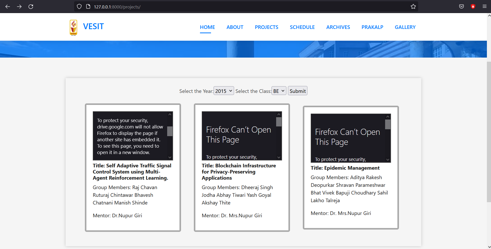

# E-Pradarshini

[](https://badges.pufler.dev) 
[](https://badges.pufler.dev)
[](https://badges.pufler.dev)
[](https://badges.pufler.dev)
[](https://www.python.org/)

---

Backend for the E-Pradarshini portal to showcase projects



---

Steps to run

1. Download zip 

2. Create a virtual enviornment, e.g.
    
  > Linux
  
  ```
  pip install virtualenv  
  virtualenv venv  
  source venv/bin/activate  
  pip install -r requirements.txt
  ```
  
  > Windows
  
  ```
  pip install virtualenv  
  virtualenv venv  
  .\venv\scripts\activate  
  pip install -r requirements.txt
  ```

3. Run the migrations

```
  python manage.py migrate
```

4. Run the local development server on localhost

```
python manage.py runserver
```
    
    


